Optoelectronic Devices (Photodiodes)
# Definition
**Optoelectronic**: functions involving the interaction of photons with semiconductors.
**Optoelectronics Devices**: devices that detect photons and those that emit photons.
**Photoconductors**: are devices or materials that exhibit photoconductivity. Photoconductivity refers to the change in electrical conductivity of a material when exposed to light.
# Types of Optoelectronic Devices
There is a wide variety of very interesting and useful device functions involving the interaction of photons with semiconductors:
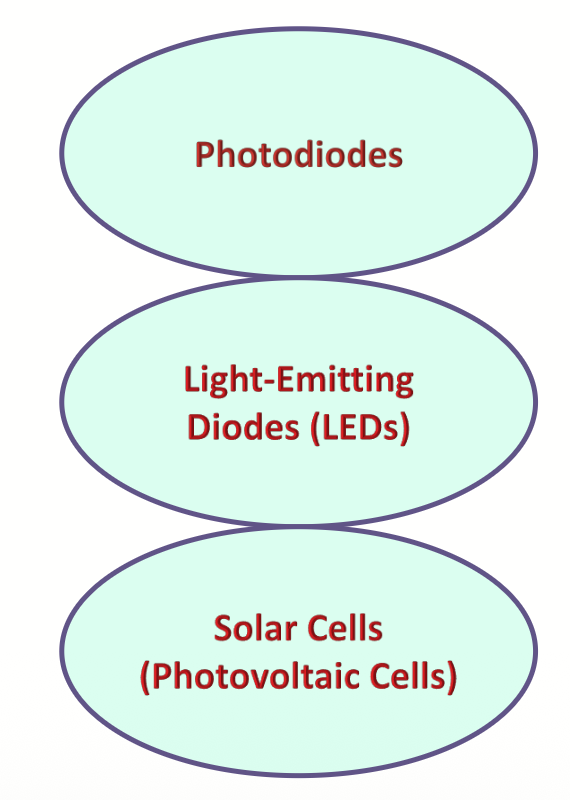
1. Devices that convert optical energy into electrical energy include photodiodes and solar cells.
2. Emitters of photons include incoherent sources such as light-emitting diodes (LEDs) and coherent sources in the form of lasers.

# Photodiodes
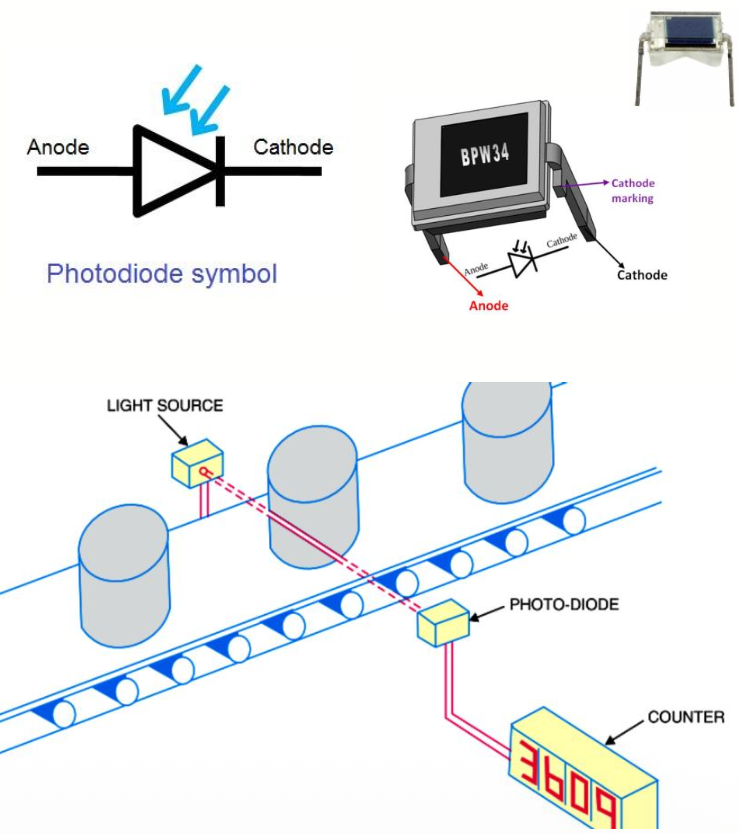
Photodiodes: Two-terminal devices designed to respond to photon absorption.
> Some photodiodes have extremely high sensitivity and response speed.
> Since modern electronics often involves optical as well as electrical signals, photodiodes serve important functions as electronic devices.

## Energy Band Diagram
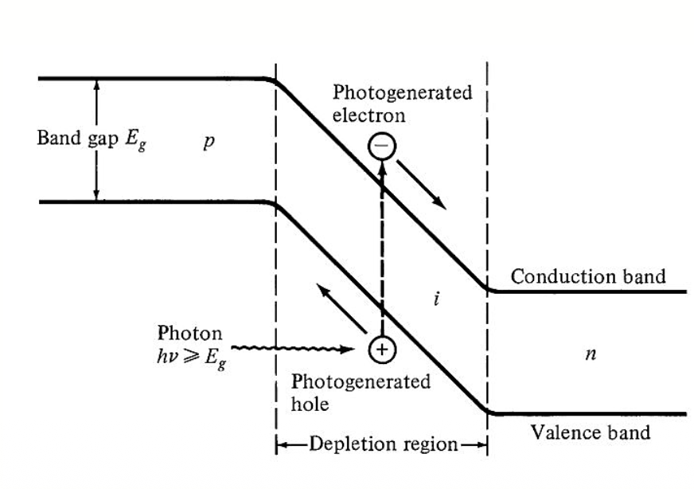
Unbiased Photodiode:
In the absence of external bias voltage, a photodiode typically has a built-in potential due to the difference in energy levels between the p-type and n-type semiconductor materials.
Incident Light:
When photons from incident light strike the photodiode, they may be absorbed by the semiconductor material.

## External Bias Applied
Under Bias Applied
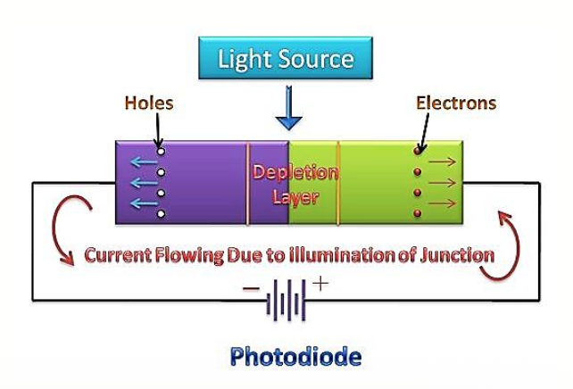
1. If an external voltage is applied in reverse bias (negative voltage applied to the p-type and positive voltage applied to the n-type), it increases the width of the depletion region.
2. This reverse bias helps to sweep the generated electrons and holes away from the junction, reducing the recombination of charge carriers.

Current Flow
The electrons and holes, separated by the electric field in the depletion region, contribute to the photocurrent.
## Current and Voltage in an Illuminated Junction
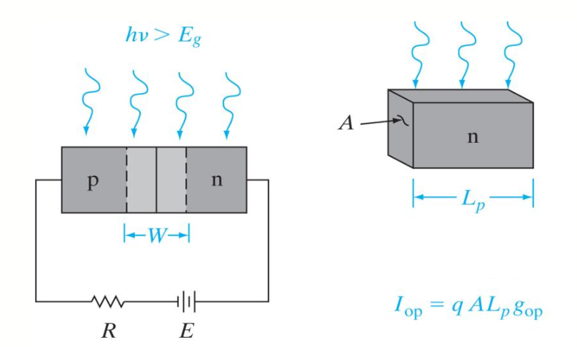
> (a) absorption of light by the device
> (b) current $𝐼_{𝑜𝑝}$ resulting from EHP generation within a diffusion length of the junction on the n side;

The resulting current due to the collection of optically generated carriers by the junction is
$$I_{op}=qAg_{op}(L_p+L_n+W)$$
> $𝑔_{𝑜𝑝}$: the optical generation rate ( $𝐸𝐻𝑃/𝑐𝑚^3𝑠$)
> 𝐴 : the cross-sectional area of the junction.
> 𝑞 : the elementary charge $1.6 × 10^{-19}$ 𝐶𝑜𝑢𝑙𝑜𝑚𝑏𝑠.
> $𝐿_𝑝$ : the diffusion length for holes.
> $𝐿_𝑛$ : the diffusion length for electrons.
> 𝑊 : the width of the depletion region.

## Total Reverse Current with Illumination
If we call the thermally generated current ($𝐼_{𝑡ℎ}$), we can add the optical generation ($𝐼_{𝑜𝑝}$) to find the total reverse current with illumination:
$$I=I_{th}(e^{qV/kT}-1)-I_{op}$$
> 𝑉 is the applied voltage.
> 𝑘 is Boltzmann's constant ($1.38 × 10^{-23}J/K$)
> 𝑇 is the temperature in Kelvin

This equation can be considered in two parts—the current described by the usual diode equation and the current due to optical generation.

## Current-Voltage (I-V) Curve
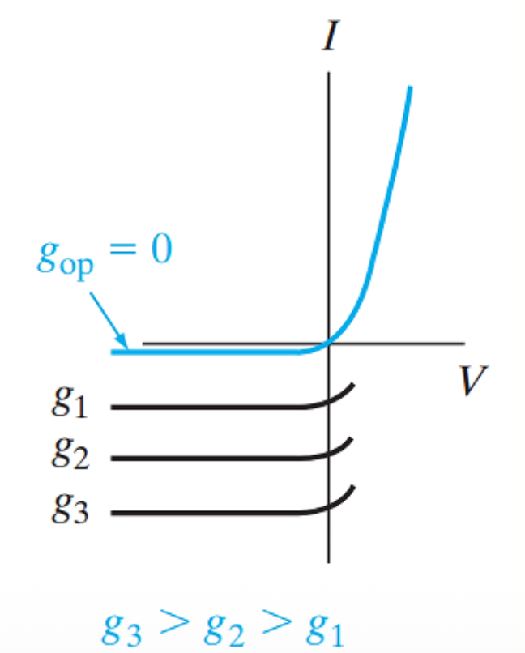
> The I–V curve is lowered by an amount proportional to the generation rate.

## Short Circuit Current
when the device is short circuited (𝑉 = 0), the diode terms from the equation of total reverse current illumination cancel, as expected.
$$I=I_{th}(e^{qV/kT}-1)-I_{op}=-I_{op}$$

## Open Circuit Voltage
when there is an open circuit across the device, $𝐼 = 0$ and the voltage $𝑉 = 𝑉_{𝑜𝑐}$ is
$$V_{oc}=\frac{kT}{q}\ln[\frac{I_{op}}{I_{th}}+1]$$
> $I_{op}$ is the optically generated current
> $I_{th}$ is thermally generated current

## I-V characteristics
Depending on the intended application, the photodiode can be operated in either the third or fourth quarters of its I–V characteristic.
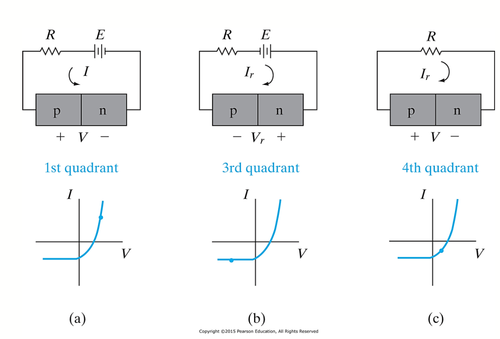
> In (a) and (b), power is delivered to the device by the external circuit
> In (c) the device delivers power to the load.

## Photodetectors
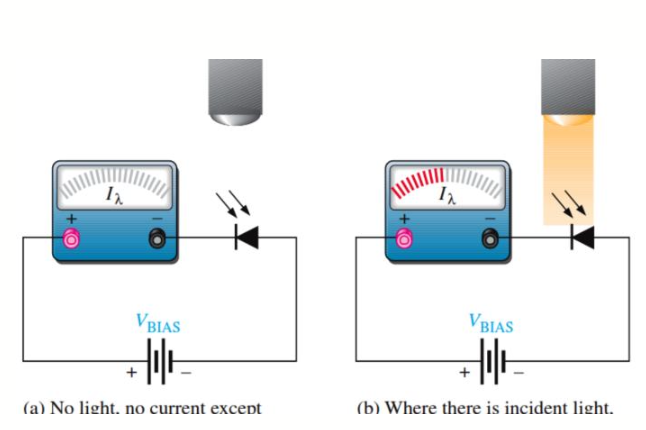
1. When the photodiode is operated in the third quadrant of its I–V characteristic, the current is essentially independent of voltage but is proportional to the optical generation rate.
2. In most optical detection applications, the detector’s speed of response is critical.
3. The appropriate width for width of the depletion (W) is chosen as a compromise between sensitivity and speed of response.
One convenient method of controlling the width of the depletion region is to build a p-i-n photodetector.

## Types of Photodiodes
Photodiodes come in various types and configurations, each designed for specific applications based on factors such as sensitivity and speed of response. Three common types of photodiodes are as follows:
### PN Photodiode
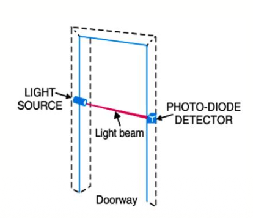
1. The most basic type of photodiode, consisting of a p-n junction.
2. It operates in reverse bias mode to generate photocurrent when exposed to light.
3. They are versatile and used in many general-purpose applications.

### PIN Photodiode
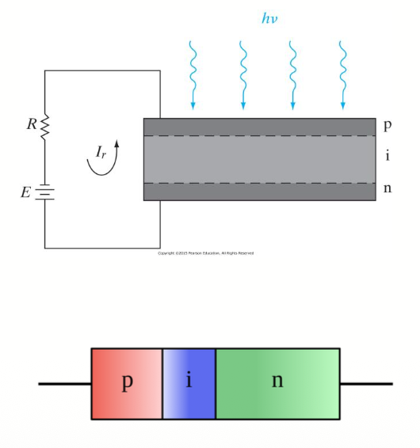
1. PIN (p-type, intrinsic, n-type) photodiodes have an intrinsic (i) layer between the p and n layers.
2. PIN diodes have low dark current means very low electric current flows through the diode when no photons enter the diode.
3. They are capable of detecting light over a broader wavelength range.
4. PIN photodiodes are often used as photodetector in high-speed and low-noise applications.

### Avalanche Photodiode (APD)
1. APDs are designed for extremely high sensitivity.
2. They incorporate avalanche multiplication, where carriers generated by incident photons trigger an avalanche effect, resulting in higher photocurrent.
3. APDs are used in low-light-level detection, such as in astronomy, fiber- optic telecommunication and LIDAR (Light Detection and Ranging) systems.

## Responsivity
The primary equation that governs the operation of a photodiode is the relationship between the generated photocurrent ($𝐼_{𝑜𝑝}$), incident light power (𝑃), and the photodiode's responsivity (𝑅):
$$Responsivity(R)=\frac{I_{op}}{P}, I_{op}=P\times R$$
> $𝐼_{𝑜𝑝}$ is the photocurrent generated by the photodiode (in amperes, A).
> 𝑃 is the incident optical power (in watts, W).
> 𝑅 is the responsivity of the photodiode (in amperes per watt, A/W).

## Responsivity
The responsivity also can vary with wavelength, so it's often specified as a function of wavelength 𝑅(𝜆):
$$R_{\lambda}=\eta\frac{q}{hf}\approx \eta\frac{\lambda_{(\mu m)}}{1.23985}$$
> η is the quantum efficiency.
> 𝑅(𝜆) is the responsivity of the photodiode at a specific wavelength 𝜆 (in A/W).
> 𝑞 is the electron charge
> 𝑓 is the frequency of the optical signal
> ℎ is Planck's constant

## Quantum Efficiency
In a photodiode (or some other photodetector), the quantum efficiency can be defined as the fraction of incident photons which contribute to the external photocurrent.
$$\eta=\frac{Number\ of\ electron/holes\ Generated}{Number\ of\ Incident\ photons}$$

## Responsivity (Typical Photodetector Characteristic)
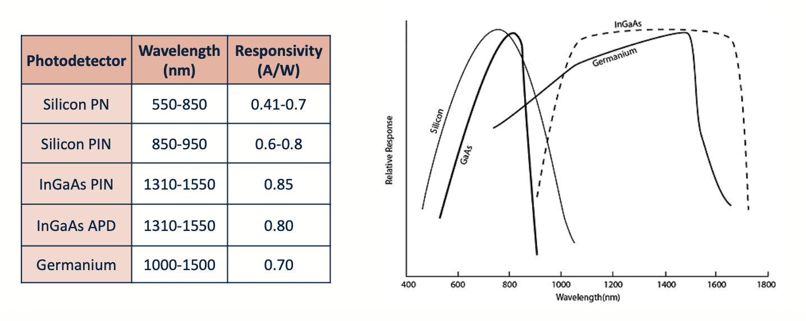

## Dark Current
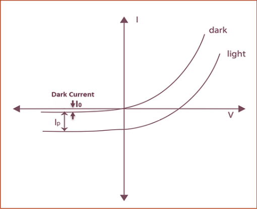
1. In the reverse bias region (negative voltage applied), the photodiode's dark current is plotted.
2. Dark current is the small current that flows through the photodiode when there is no incident light.
3. The dark current is slightly increased as the reverse bias voltage increases.
4. The dark current is affected by the photodiode material, temperatures (thermal generation) and the size of the active area.
5. Silicon devices generally produce lower dark current compared to germanium devices.

## Photodiode Operating Modes
A photodiode can be operated in one of two modes:
1. Photoconductive (reverse bias)
2. Photovoltaic (zero-bias)
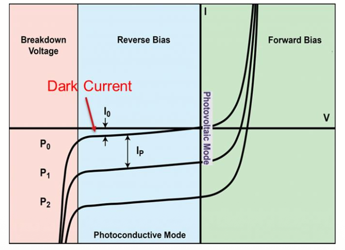
> Mode selection depends upon the application's speed requirements and the amount of tolerable dark current (leakage current).

### Photovoltaic
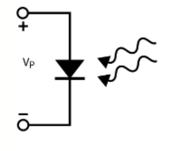
1. In photovoltaic mode the photodiode is zero biased.
2. The flow of current out of the device is restricted and a voltage builds up.
3. This mode of operation exploits the photovoltaic effect, which is the basis for solar cells
4. The amount of dark current is kept at a minimum when operating in photovoltaic mode.

### Photoconductive
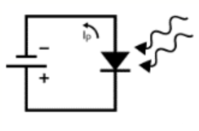
1. In photoconductive mode, an external reverse bias is applied, which is the basis for our high-speed optical communication.
2. The current measured through the circuit indicates illumination of the device; the measured output current is linearly proportional to the input optical power.
3. Operating under these conditions does tend to produce a larger dark current, but this can be limited based upon the photodiode material.

