# Definition & Principles
**A light emitting diode (LED)** is essentially a _pn_ junction diode typically made from a direct bandgap semiconductor, for example, GaAs, in which the EHP recombination results in the emission of a photon.
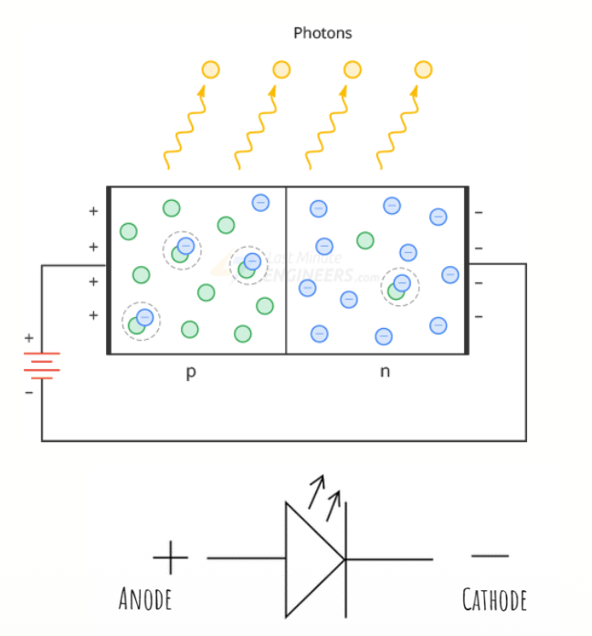
The emitted photon energy ℎ𝑓 is approximately equal to the bandgap energy $E_g$.
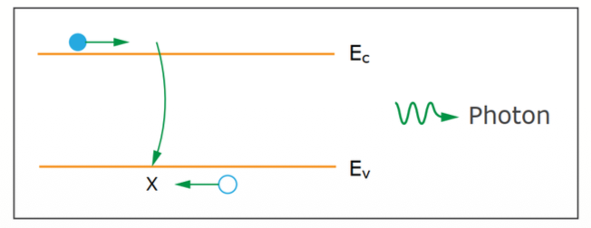
**Direct vs Indirect Band Gaps**
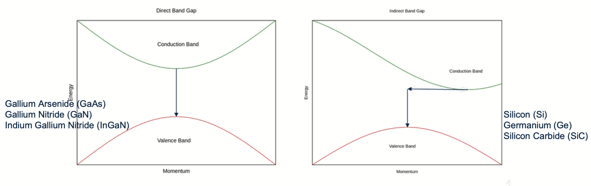
> In a direct bandgap semiconductor, electrons fall straight down to recombine with holes and emit light efficiently because their momentum matches. In an indirect bandgap semiconductor, electrons must move sideways (change momentum) with the help of a phonon before recombining, making light emission very inefficient.

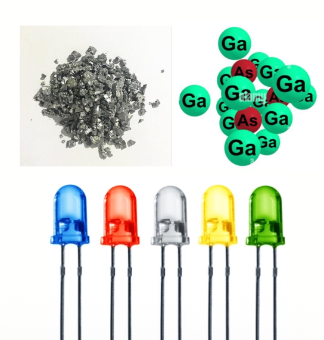
1.  LEDs are typically made from semiconductor materials, such as Gallium Arsenide (GaAs), Gallium Nitride (GaN), or Indium Gallium Nitride (InGaN).
2. The choice of semiconductor material has a significant impact on the color of light emitted by the LED.
3.  By adjusting the composition of these semiconductor materials, manufacturers can produce LEDs that emit light across a broad spectrum of colors.

# Advantages
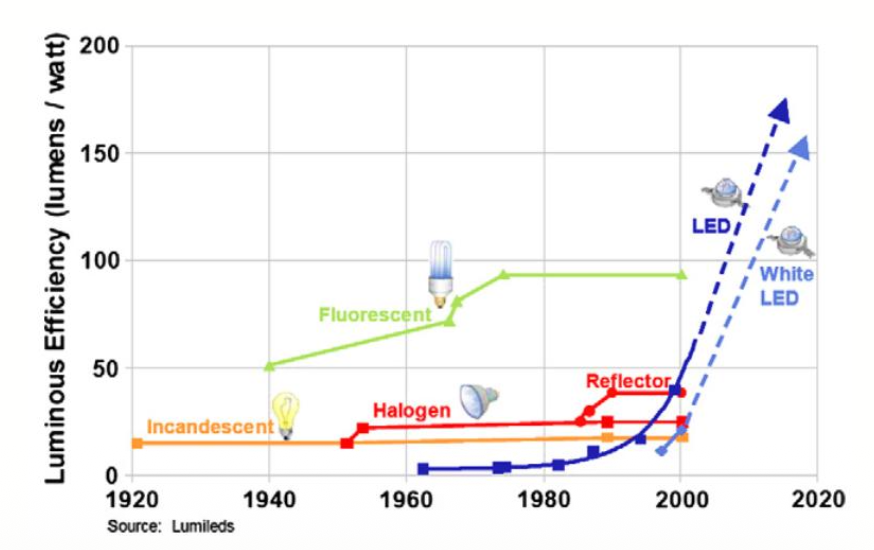
Efficiency; Color Variation; Longevity; Instant On/Off; Directionality; Compact Size; Environmental Benefits; High Reliability
# Common Types of LED
## Standard Visible LEDs
1. Description: These LEDs emit light in the visible spectrum and are available in various colors, including red, green, blue, yellow, and white.
2. Application: General lighting, indicator lights, displays, signage, and consumer electronics, and other applications.
## Infrared (IR) LEDs
1. Description: Emit light in the infrared spectrum, which is not visible to the human eye.
2. Application: Remote controls, security systems, optical communication, night vision
devices.
## High-Power LEDs
1. Description: Designed to emit a high amount of light and are used in applications requiring bright and concentrated illumination. They come in various colors and can produce intense light output.
2. Application: Automotive headlights, architectural lighting, flashlights, stage lighting, and high-intensity applications.
## RGB LEDs
1. Description: Contain Red, Green, and Blue LED chips in a single package, allowing for the creation of a wide range of colors by varying the intensity of each color component.
2. Application: LED displays, mood lighting, color-changing lighting systems, entertainment lighting, and decorative lighting.

# Components of a Conventional LED
A conventional LED consists of several key components include:
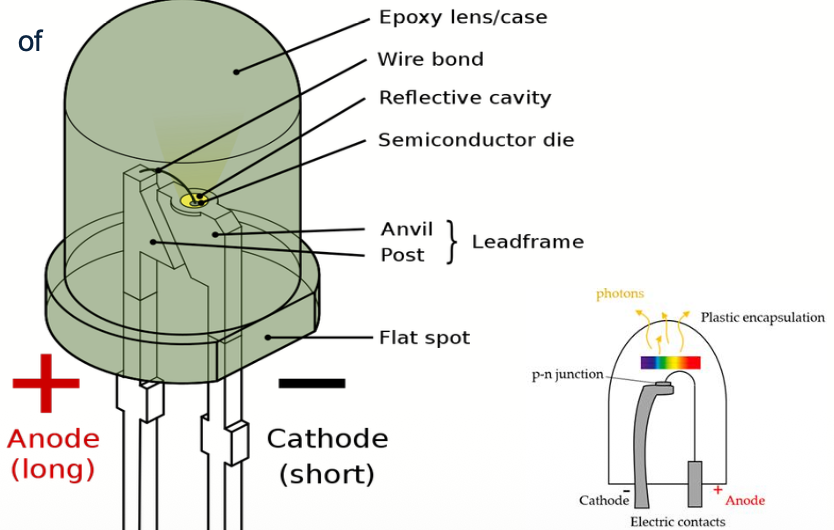
# Energy Band Diagram
Energy band diagram of a _pn_ (heavily n-type doped) junction.
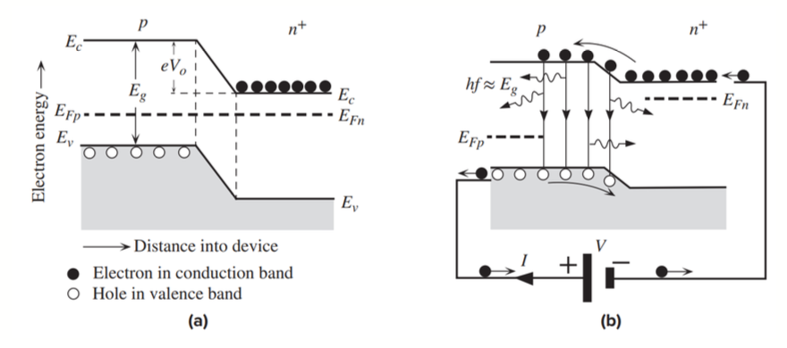
> (a) No bias voltage. The p-layer is usually thin. The Fermi level is uniform across the whole device; $E_{FN}=E_{Fp}$.
> (b) With forward bias V. Direct recombination around the junction and within the diffusion length of the electrons in the p-side leads to photon emission. The Fermi levels are separated and $E_{FN}-E_{Fp}=eV$.

# Injection Electroluminescence
1. Electroluminescence (EL) is an optical process that leads to the generation of photons as a result of the radiative recombination of holes and electrons during the passage of an electric current through a material.
2. In _pn_ junction with heavily n-type doped, the phenomenon of light emission from the EHP recombination as a result of minority carrier injection is called _injection electroluminescence_.
# Spontaneous Photon Emission
1. Due to the statistical nature of the recombination process between electrons and holes, the emitted photons are in random directions; they result from spontaneous recombination processes between electrons and holes.
2. Such spontaneous recombination processes result in _spontaneous photon emission_.
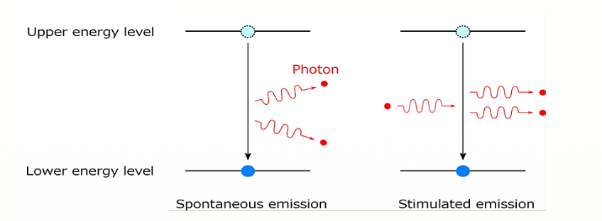
# Heterojunction High-Intensity LEDs
1. **Homojunction:** A _pn_ junction between two differently doped semiconductors that are of the **same material**, that is, the same bandgap $𝐸_𝑔$.
2. **Heterojunction:** A junction between two different bandgap semiconductors is called a heterojunction. A semiconductor device structure that has junctions between **different bandgap materials** is called a heterostructure device.
3. **Double-Heterostructure (DH):** LED constructions for **increasing the intensity** of the output light make use of the double heterostructure.
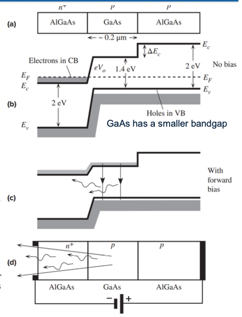
> (a) A double heterostructure diode has two junctions which are between two different bandgap semiconductors. (GaAs and AIGaAs).
> (b) A simplified energy band diagram with exaggerated features. $E_F$ must be uniform. 
> (c) Forward-biased simplified energy band diagram.
> (d) Forward-biased LED. Schematic illustration of photons escaping reabsorption in the AIGaAs layer and being emitted from the device.
# Quantum Well High Intensity LEDs
1. A typical quantum well (QW) device has an ultra thin, typically less than 50 nm, narrow bandgap semiconductor with a bandgap Eg1 sandwiched between two wider bandgap semiconductors with a bandgap Eg2.
2. The quantum well could be a thin **GaAs (Eg1)** layer sandwiched between two **AlGaAs (Eg2)** layers.
3. The wide bandgap layers are called **confining layers**.

> (a) A single quantum well of a smaller bandgap material (Eg1) of thickness d along x surrounded by a thicker material of wider bandgap (Eg2).
> (b) The electron energy levels associated with motion along x are quantized as E1, E2, E3, etc.
> (c) A QW structure that shows the energy levels in the wells and how charge carriers that are brought in by the current fall into the lowest energy level in the well and then recombine, emitting a photon.

4. The two semiconductors are always lattice-matched, that is, they have the same crystal structure.
5. By adjusting the **thickness and composition of the quantum well**, engineers can control the energy levels and, consequently, the wavelength of the emitted light.
6. This control over the emission wavelength is valuable for producing LEDs with **specific colors**, contributing to the versatility of quantum well LEDs.
**Applications**:
Display technologies, solid-state lighting, medical imaging, sensors, optical communication, military, entertainment, and so on.
# Light-Emitting Materials
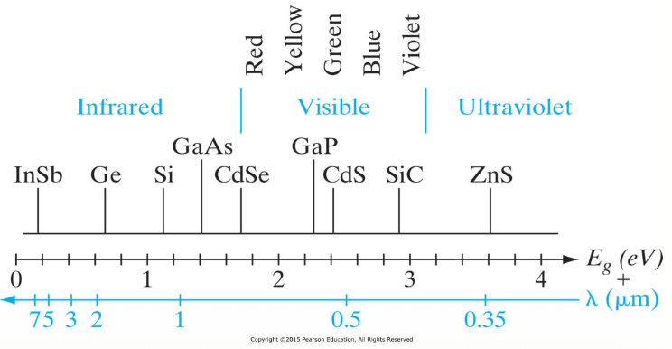
In view of the broad range of applications requiring semiconductor lasers and LEDs with visible and infrared wavelengths, the wide variety of available III–V materials is extremely useful.
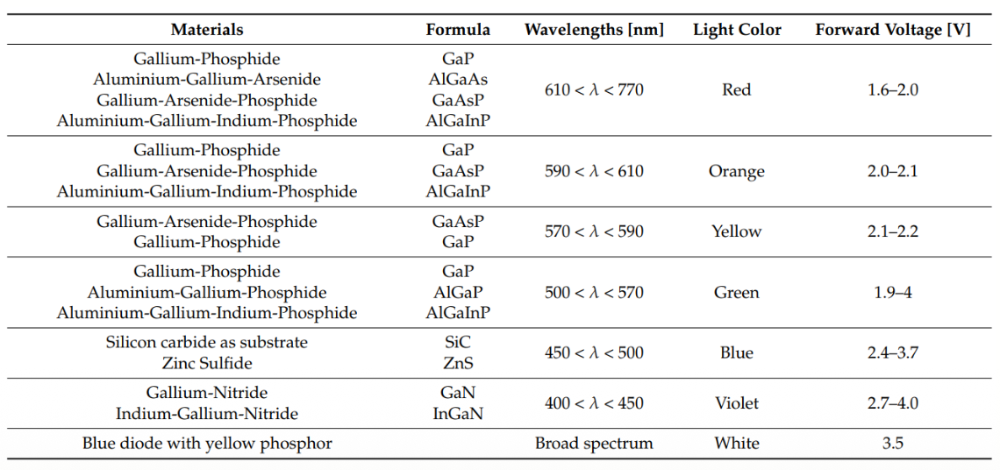
There is a wide variation in band gaps and, therefore, in available photon energies, extending from the ultraviolet (ZnS, 3.6 eV) into the infrared (InSb, 0.18 eV).
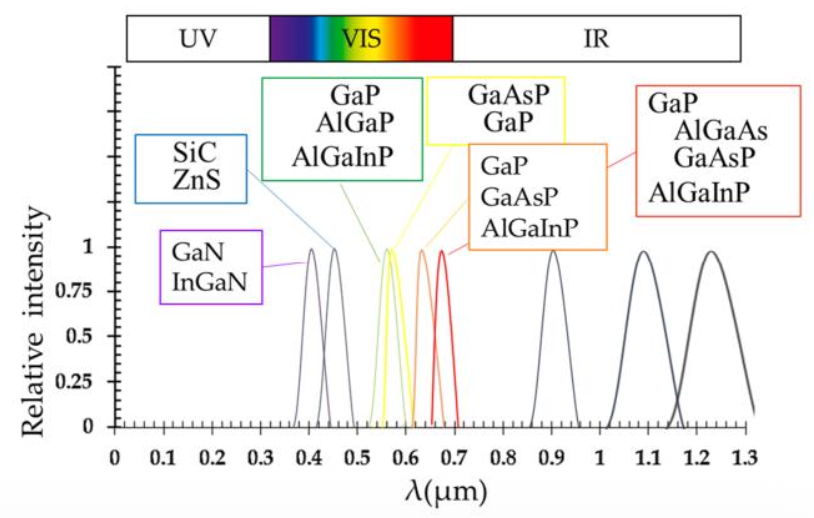
This Figure shows spectral distribution emitted by an LED fabricated from various semiconductors.
The emission spectrum becomes narrower in terms of wavelength as the emission energy moves from the infrared to the ultraviolet ends of the spectrum.
# Improvement of Luminous Intensity of LEDs Over Time
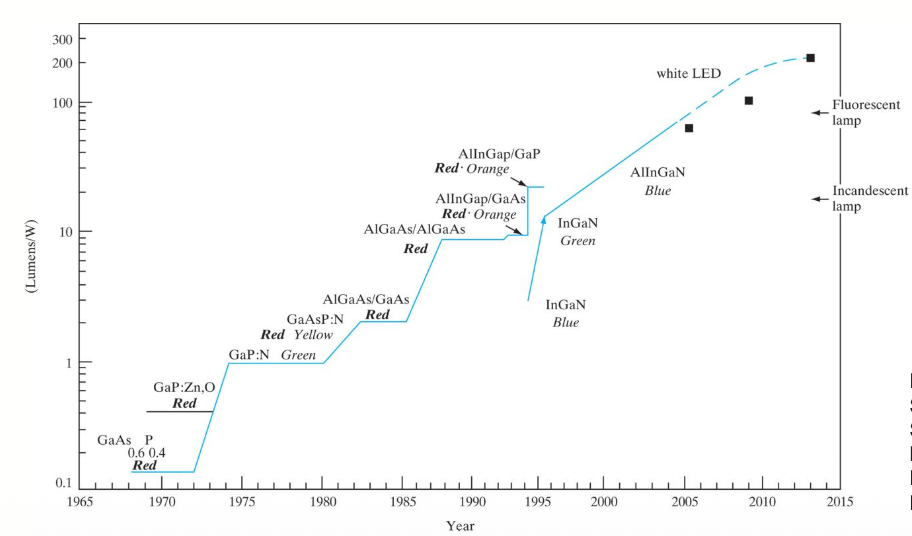
# LED Current-Voltage (I-V) Curve
In order to obtain visible radiation, energy gaps have to be greater than about 1.8 eV.
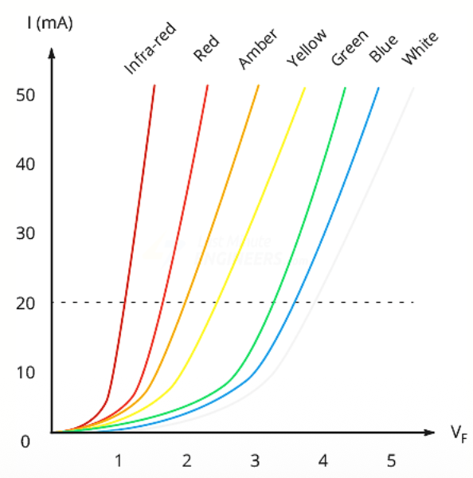
The most common commercial LEDs require an operating voltage approximately between 1.6 and 3.6 V with a current rating from 10 to 30 mA, with 12 to 20 mA being the most common range.
# Emission Wavelength
If the transitions take place in a direct bandgap semiconductor, the emission wavelength $\lambda$ is:
$$\lambda = \frac{hc}{E_g},$$
$$E_g(eV)=1.24/\lambda(\mu m)$$
> Where 𝐸𝑔 is the energy band gap, ℎ is Planck's constant, and 𝑐 is the speed of light.

# Quantum Efficiency
A very important metric of an LED is the **external quantum efficiency**, quantifies the conversion efficiency of electrical energy into external optical energy:
$$\eta_{EQE}=\eta_{IQE}\times \eta_{EXT}$$
> $𝜂_{𝐸𝑄𝐸}$ is the external quantum efficiency.
> $𝜂_{𝐼𝑄𝐸}$ is the internal quantum efficiency.
> $𝜂_{𝐸𝑋𝑇}$ is the extraction efficiency.

Internal Quantum Efficiency (IQE)
$$\eta_{IQE}=\frac{number\ of\ photons\ emitted\ from \ active\ region\ per\ second}{number\ of\ injected\ electrons\ per\ second}$$
Extraction Quantum Efficiency
$$\eta_{EXT}=\frac{number\ of\ photons\ emitted\ into \ free\ space\ per\ second}{number\ of\ photons\ emitted\ from\ active\ region\ per\ second}$$
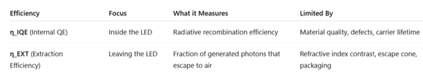
# Light Escape Cone in LED
1. The light-escape cone is defined by the angle for total internal reflection (TIR). Photons emitted into the cone can escape from the semiconductor. On the other hand, photons emitted outside the cone is subject to total internal reflection
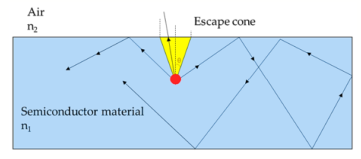
2. In the context of LEDs, it is crucial for understanding and optimizing LED performance.
$$\theta_c=sin^{-1}(\frac{n_2}{n_1})\ with\ n_2<n_1$$
> n1 is the refractive index of the material inside the LED (often a semiconductor material)
> n2 is the refractive index of the surrounding medium (such as air or a lens).
> 𝜃𝑐 is the named the critical angle.

3. The surface area of the calotte-shaped surface is given by
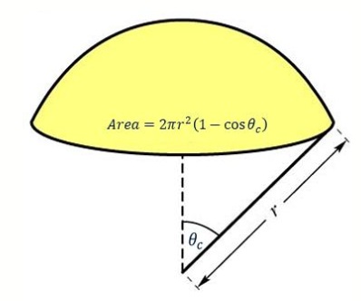
$$Area=2\pi r^2(1-\cos\theta_c)$$
4. The entire surface area of the sphere with radius 𝑟 is $4𝜋𝑟^2$.
5. The fraction of light that can escape can be computed by:
$$P_{Scape}=\frac{2\pi r^2(1-cos\theta_c)}{4\pi r^2}=\frac{1}{2}(1-cos\theta_c)$$
6. The calculated results indicate that only a fraction of the light emitted inside a semiconductor can escape from the semiconductor.
## Relation to LED Performance
1. The escape problem is a significant problem for high-efficiency LEDs.
2. In most semiconductors, the refractive index is quite high ( > 2.5 ) and thus only a small percentage of the light generated in the semiconductor can escape from a planar LED.
3. For instance, gallium arsenide-based materials, common for red LEDs, have a very high refractive index (n = 3.4) and the escape cone has $𝜃_𝑐= 17.1°$, meaning that only about 2% of the light can escape.
4. By optimizing the refractive indices of the materials and the angle of incidence, engineers can tailor LED designs to maximize light extraction.
5. One of the most used techniques to widen the escape cone and increase the EQE is to surround the junction in a transparent plastic encapsulation ($𝑛_2 = 1.5$).
How critical angle can affect on LED performances?
6. The **critical angle ($θc$)** determines the size of the **light escape cone**—the angular region in which photons can escape from the semiconductor into air (or another surrounding medium). It directly affects how much of the light generated inside the LED actually leaves the device.
7. If θc is increased, more photons fall within the escape cone. Ways to increase θc :
> Using an encapsulation material (e.g., polymer with n ≈ 1.5)
> Texturing the surface
> Shaping LED geometry (e.g., dome lenses)
> Using transparent packaging

