Solar Cells
# Introduction
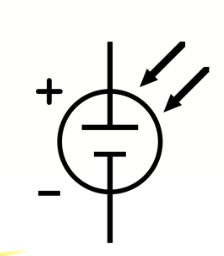
1. Most solar cells use crystalline silicon since silicon-based semiconductor fabrication is now a mature technology that enables cost-effective devices to be manufactured.
2. Typical Si-based solar cell efficiencies range from about 18% for polycrystalline to 22-24% in high-efficiency single-crystal devices that have special structures to absorb as many of the incident photons as possible.
3. Solar cells fabricated by making a _pn_ junction in the same crystal are called homojunctions.
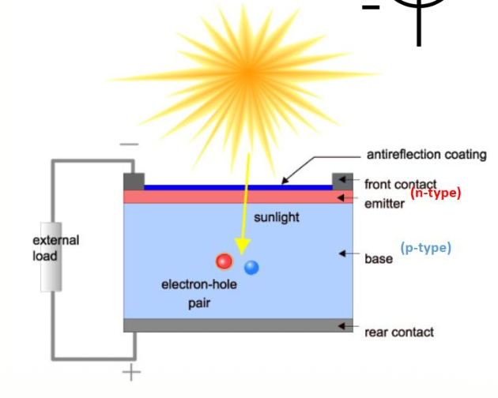
# History
1. 1839 - **Alexandre Edmond Becquerel** observes the photovoltaic effect via an electrode in a conductive solution exposed to light.
2. 1941 - **Russell Shoemaker Ohl** was an American engineer who is generally recognized for patenting the modern solar cell (US Patent 2402662, "Light sensitive device") based on pn-junction device.
3. 1954 - **Bell Labs** announces the invention of the first practical silicon solar cell.
# Application
1. E-car components (roof, bonnet, outer shell)
2. The photovoltaic solar panels
3. satellite
# Declining Costs & Exponential Growth
# Solar Cell Operation
Since power can be delivered to an external circuit by an illuminated junction, it is possible to convert solar energy into electrical energy.
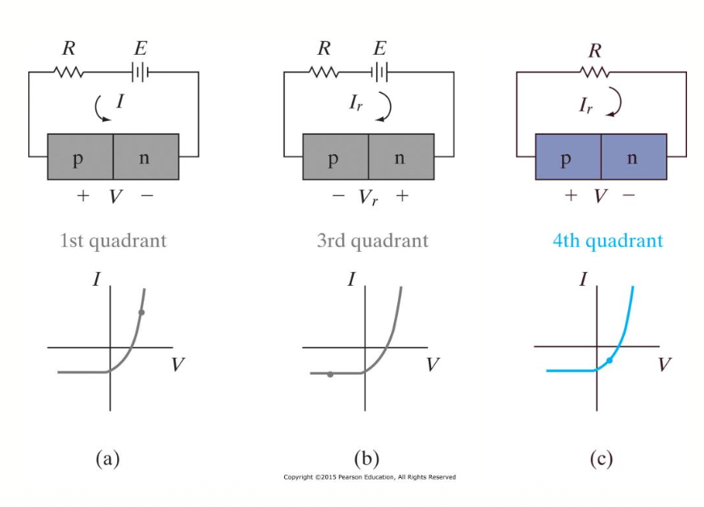
Q: Why must a solar cell be operated in the 4th quadrant of the junction I-V characteristics?
A: Power is only generated in the 4th quadrant (-I,+V). Power is consumed in the 1st (+I,+V) and 3rd (-I,-V) quadrant.
1. A simplified schematic diagram of a typical solar cell is shown in this figure.
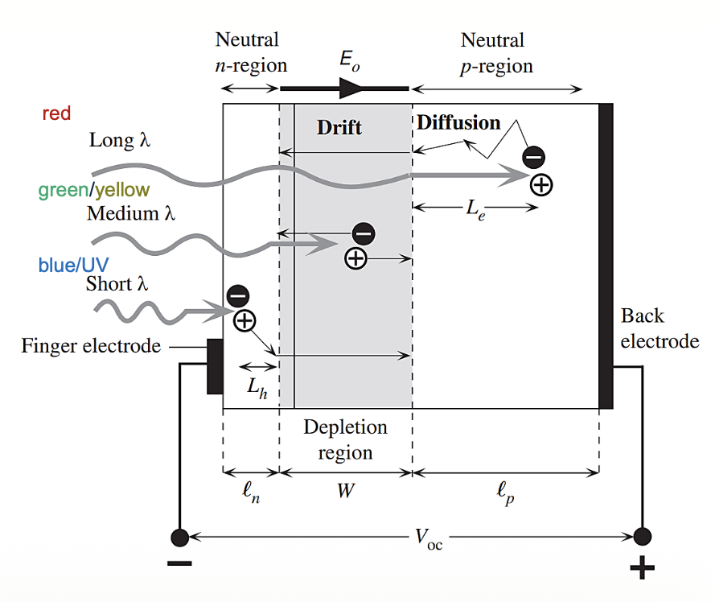
2. Consider a pn junction with a very narrow and more heavily doped n-region.
3. The illumination is through the thin n-side.
4. The depletion region (W) extends primarily into the p-side.
5. There is a built-in field $E_o$ in this depletion layer. The built-in field change upon illumination.
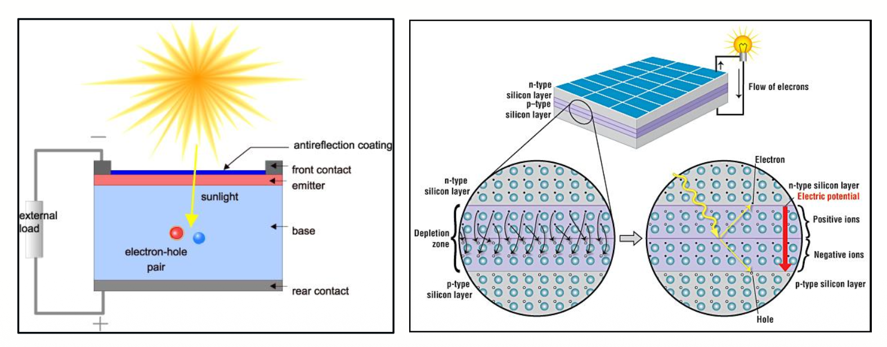
6. As the n-side is very narrow, most of the photons are absorbed within the depletion region (W) and within the neutral p-side and photogenerated EHPs in these regions.
7. EHPs photogenerated in the depletion region are immediately separated by the built-in field Eo which drifts them apart.
8. The electron drifts and reaches the neutral n-side whereupon it makes this region negative by an amount of charge −e.
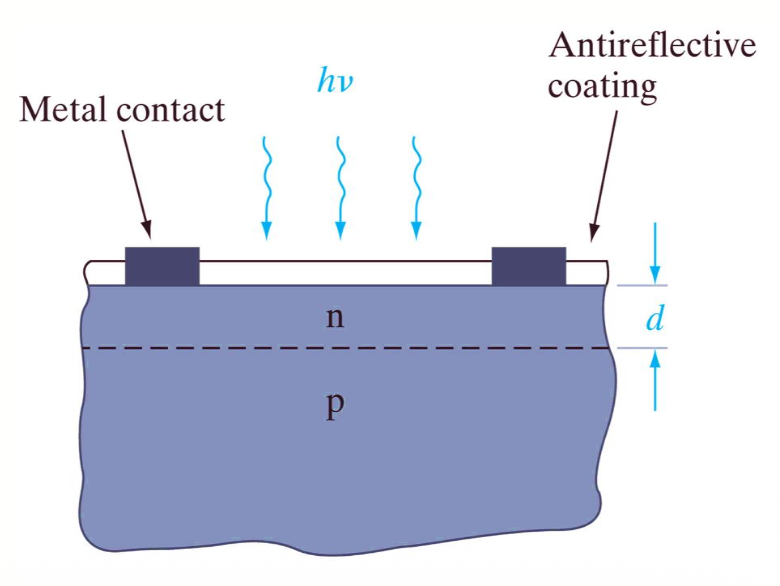
9. The electrodes attached to the n-side must allow illumination to enter the device and at the same time with a small resistance.
10. They are deposited on the n-side to form an array of finger electrodes on the surface as depicted in Figure.
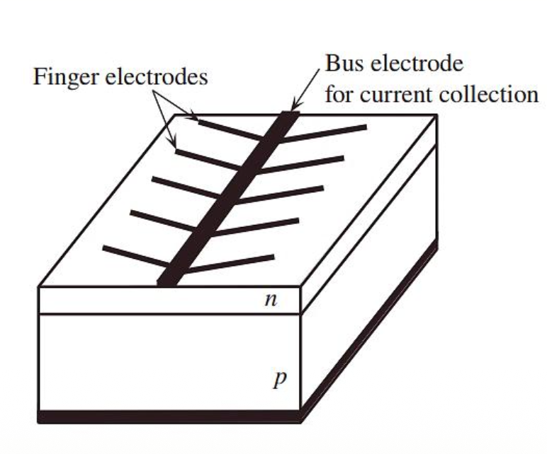
# Reflectivity
1. An antireflective layer increases the amount of light transmitted to the semiconductor (reflection is reduced).
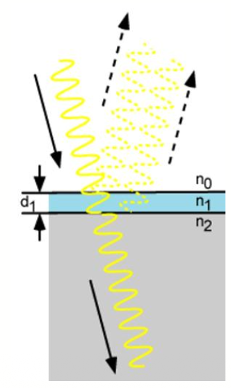
2. To compute amount of reflectivity (R), the parameters below are defined:
$$r_1=\frac{n_0-n_1}{n_0+n_1},\ r_2=\frac{n_1-n_2}{n_1+n_2},\ \theta=\frac{2\pi n_1 d_1}{\lambda} (need\ to\ convert\ to\ degree)$$
$$R=\frac{r_1^2+r_2^2+2\pi\cos2\theta}{1+r_1^2r_2^2+2\pi\cos2\theta}$$
> $n_0,\ n_1, and\ n_2$ are refractive index
> $d_1$: thickness of $n_1$(nm)
> $\lambda$: wavelength of light (nm)

3. Reflectivity depends on the thickness, refractive index, and wavelength.
4. Because reflectivity changes with wavelength, zero reflection only occurs at a specific wavelength.
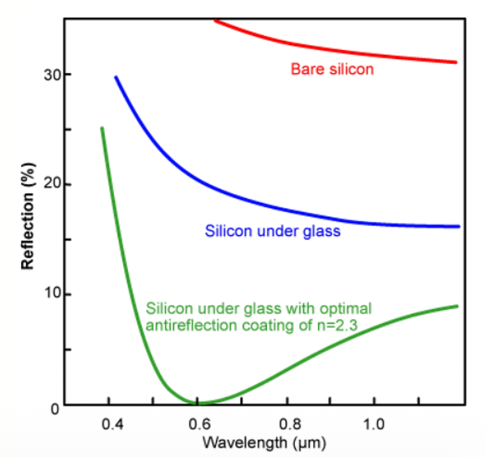
5. For photovoltaic applications, the refractive index and thickness are chosen to minimize reflection at a wavelength of 0.6 µm, which is close to the solar spectrum's peak power.
# Arrays of Solar Cells
1. If we consider the fourth quadrant, it appears doubtful that much power can be delivered by an individual device.
2. For silicon cell the voltage $𝑉_{𝑜𝑐}$ is often around 0.6 - 0.8 V per cell.
3. The current generated depends on the illuminated area, but typically $𝐼_{𝑜𝑝}$ is in the range 10 − 100 𝑚𝐴 for a junction with an area of about $1 cm^2$
4. If many such devices are used, the resulting power can be significant.
5. In fact, arrays of p-n junction solar cells are currently used to supply electrical power. E.g., for many space satellites.
# Cells, Modules, Panels and Arrays
1. Photovoltaic cells are connected electrically in series and/or parallel circuits to produce higher voltages, currents and power levels.
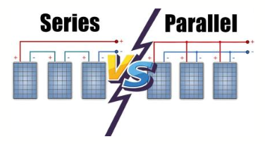
2. Photovoltaic modules consist of PV cell circuits sealed in an environmentally protective laminate and are the fundamental building blocks of PV systems.
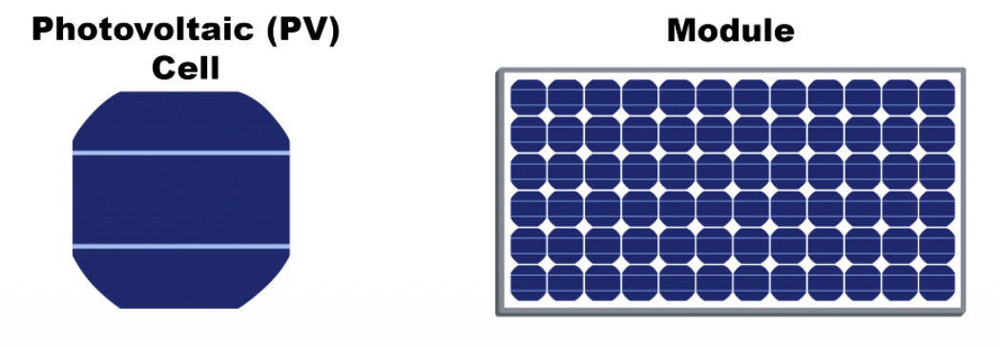
3. Photovoltaic panels include one or more PV modules assembled as a pre-wired, field-installable unit.
4. A photovoltaic array is the complete power-generating unit, consisting of any number of PV modules and panels.
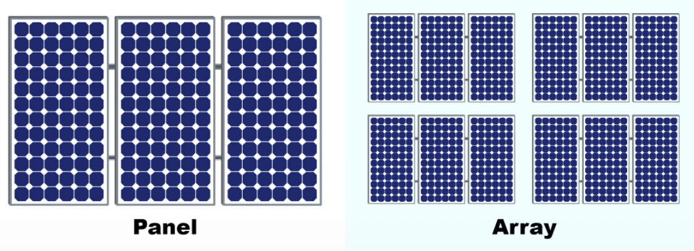
# Current in an Illuminated Junction
The resulting current due to the collection of optically generated carriers by the junction is
$$I_{sc}=I_{op}=qAg_{op}(L_p+L_n+W)$$
> $I_{sc}$: shows the short circuit current.
> A: is the cross-sectional area of the junction
> q: is the elementary charge
> $L_p$: is the diffusion length for holes
> $L_n$: is the diffusion length for electrons
> W represents the width of the depletion region

# Voltage in an Illuminated Junction
The open circuit voltage $𝑉_{𝑜𝑐}$ an across the device (𝐼 = 0) is computed by:
$$V_{oc}=\frac{kT}{q}\ln[\frac{I_{op}}{I_{th}}+1]$$
> q is the elementary charge: $1.602\times 10^{-19}C$(coulombs)
> k is Boltzmann's constant: $1.38\times 10^{-23}J/K$
> T is the absolute temperature in Kelvin (K)

# I-V Characteristics
Typical I–V characteristics of a Si solar cell.
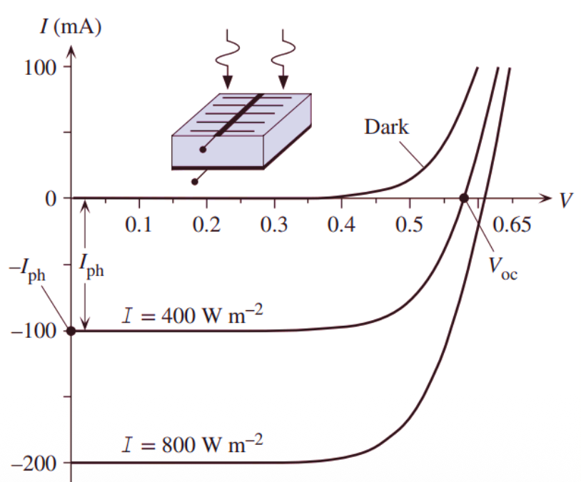
> The short circuit current is $I_{ph}$ and the open circuit voltage is $V_{oc}$.
> The I–V curves for positive current require an external bias voltage.
> Photovoltaic operation is always in the negative current region

# Maximum Power
This Figure shows the fourth-quadrant portion of a solar cell characteristic, with $𝐼_𝑟$ plotted upward for the convenience of illustration.
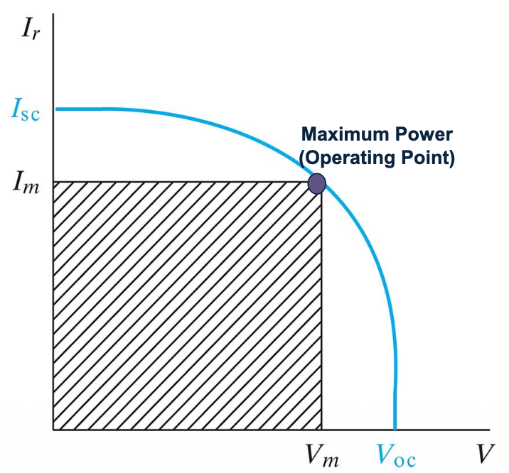
> The open circuit voltage $V_{oc}$ and the short-circuit current $I_{sc}$ are determined for a given intensity of light and the properties of the solar cell.

The maximum power delivered to a load by this solar cell occurs in the product $𝑉_𝑚 × 𝐼_𝑚$.
# Fill Factor
We can see that the maximum delivered power ($𝑉_𝑚 × 𝐼_𝑚$) illustrated by the shaded rectangle is less than the $𝑉_{𝑜𝑐} × 𝐼_{𝑠𝑐}$ product.
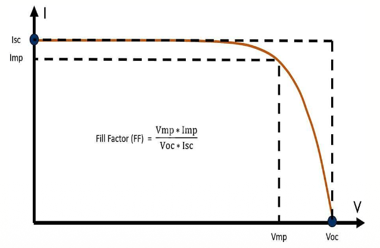
The fill factor FF, which is a figure of merit for the solar cell, is defined as:
$$FF=\frac{I_mV_m}{I_{sc}V_{oc}}$$
1. Typically, FF values are in the range 70% to 85% and depend on the device material and structure.
2. The fill factor for a normal silicon PV cell is 80%.
3. The Fill Factor (FF) is a critical parameter because it indicates how effectively a solar cell can convert the portion of available sunlight to electrical power under optimal conditions.
4. A higher FF indicates better performance and efficiency.
5. It is clearly advantageous to have the FF as close to unity as possible, but the exponential pn junction properties prevent this.
6. It helps researchers, manufacturers, and users assess the quality and efficiency of different solar cell technologies.
# Types of Solar Cells
There are several types of solar cells, each with its own materials and operating principles.
Three of the most common types of silicon solar cells are:
1. Monocrystalline Silicon Solar Cells
2. Polycrystalline Silicon Solar Cells
3. Thin-Film Solar Cells
## Monocrystalline Silicon Solar Cells
1. Monocrystalline solar cells are made from a single crystal structure, typically using high-purity silicon.
2. They are known for their high efficiency and space-efficient design, making them a popular choice for residential and commercial rooftop solar panels.
3. Monocrystalline solar cells tend to be more expensive to manufacture compared to other types, but their high efficiency often justifies the cost.
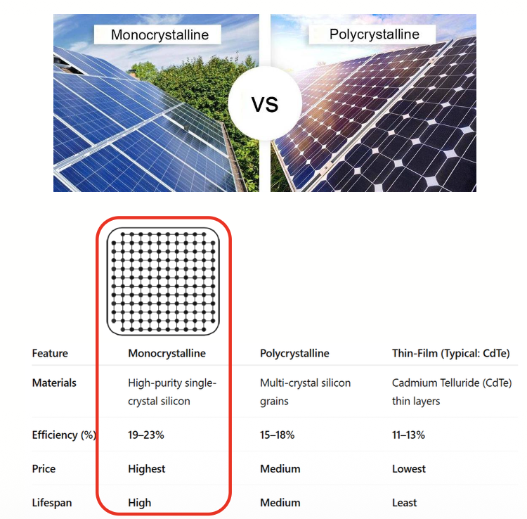
## Polycrystalline Silicon Solar Cells
1. Polycrystalline solar cells are made from multiple silicon crystals, resulting in a less uniform form compared to monocrystalline cells.
2. They are less expensive to produce than monocrystalline cells, but they are typically slightly less efficient.
3. Polycrystalline solar panels are commonly used for residential and commercial applications due to their balance between cost and efficiency.
## Thin-Film Solar Cells
1. Thin-film solar cells are made using thin layers of semiconductor materials, such as amorphous silicon (a-Si), cadmium telluride (CdTe), or copper indium gallium selenide (CIGS).
2. They are known for their flexibility and lightweight design, making them suitable for various applications, including building-integrated photovoltaics (BIPV), portable solar chargers, and even flexible solar panels.
3. Thin-film solar cells tend to have lower efficiency compared to crystalline silicon cells but can be cost-effective and advantageous in certain situations.
