# The Bipolar Transistor
## Types of Transistor
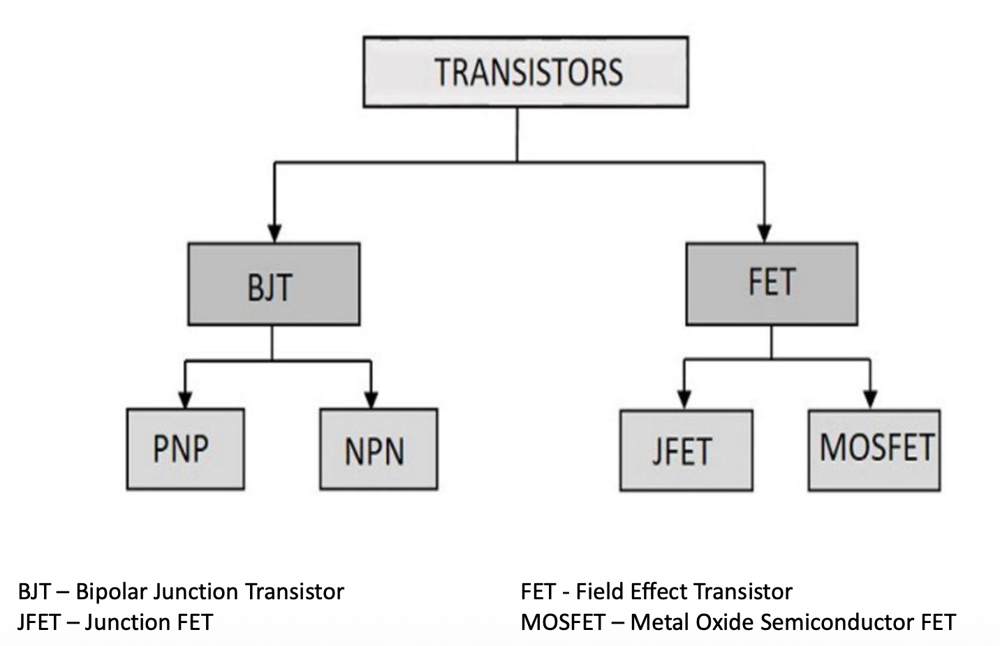
## Bipolar Junction Transistor
BJTs can be thought of as two diodes (p-n junctions) sharing a common region.
Thus, there are two possible configurations with three terminals (emitter, base, collector)
1. **npn BJT**: In a **_npn_** transistor, the BJT consists of three semiconductor regions: the emitter region (_n_ type), the base region (_p_ type), and the collector region (_n_ type)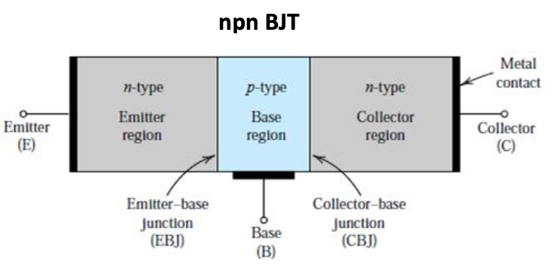
2. **pnp BJT**: _A_ **_pnp_** transistor has a _p_-type emitter, an _n_-type base, and a _p_-type collector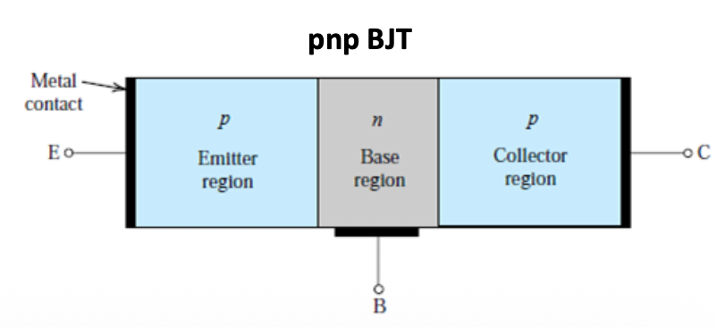
### BJT Modes of Operation
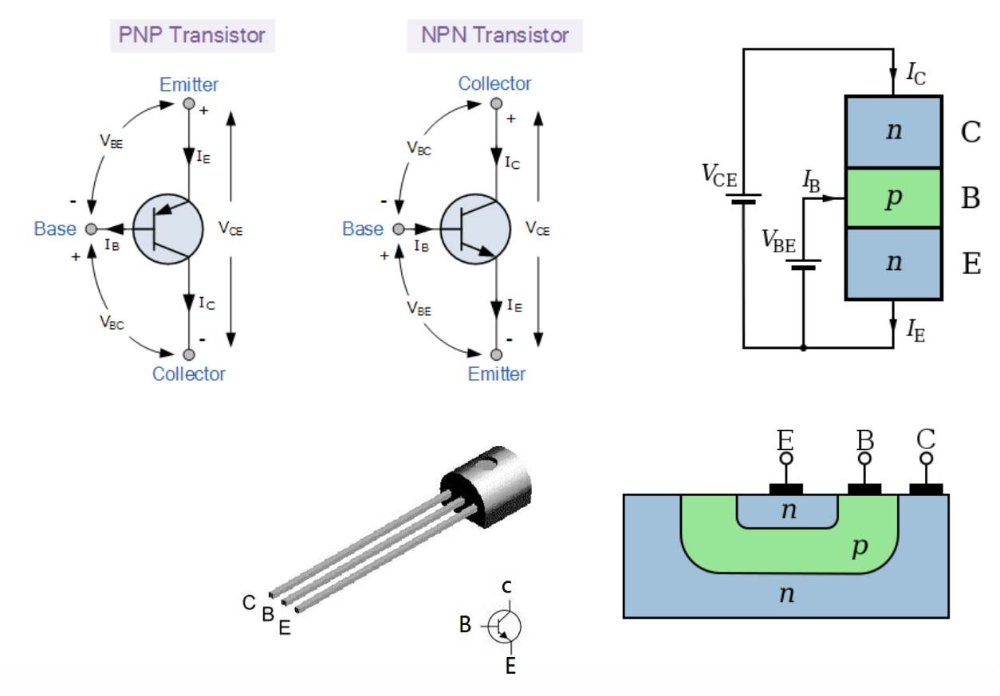
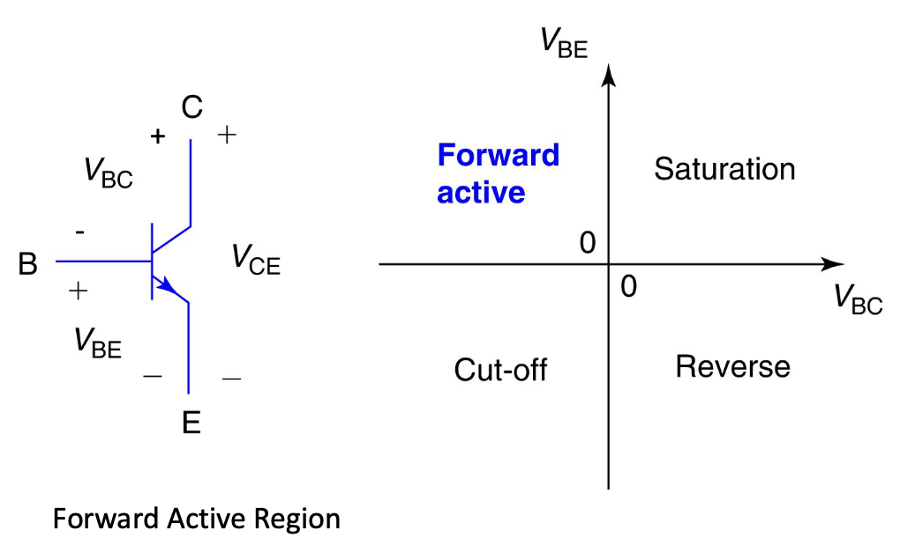
### Active Mode npn-BJT
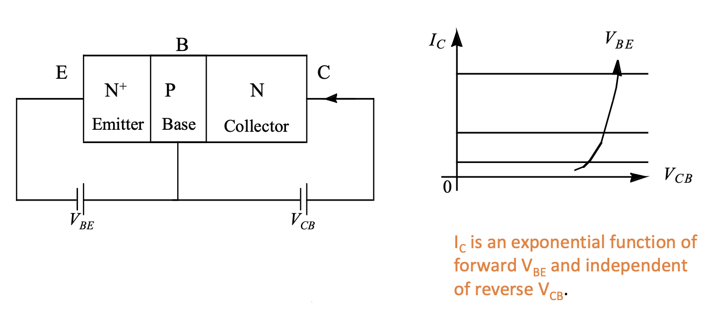
### Common-Emitter Configuration
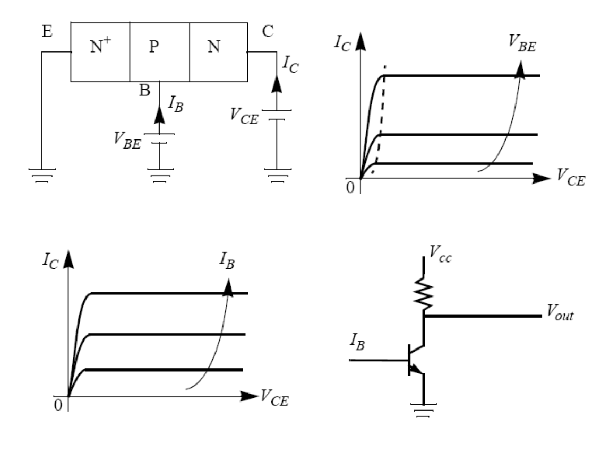
### BJT Characteristic Curve - $I_C\ vs\ V_{CE}$
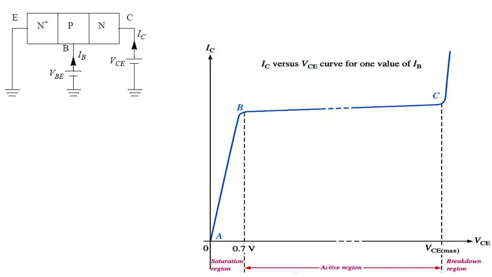
### Current
#### Collector Current
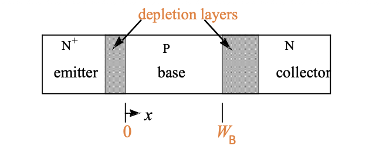
$$I_C=I_S(e^{qV_{BE}/kT}-1)=A_Eq\frac{D_B}{W_B}\frac{n_{iB}^2}{N_B}(e^{qV_{BE}/kT}-1)$$
> $D_B$: base minority carrier (electron) diffusion constant
> $N_B$: Base doping concentration
> $A_E$: Surface Area of Emitter
> $W_B$: Base Width
> $n_{iB}$: intrinsic carrier concentration of Base
#### Base Current
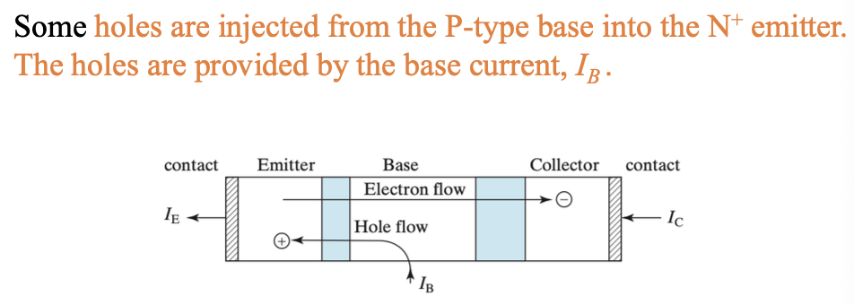
For a uniform emitter:
$$I_B=A_Eq\frac{D_E}{W_E}\frac{n_{iE}^2}{N_E}(e^{qV_{BE}/kT}-1)$$
#### Current Gain
Common-emitter current gain, $\beta_F$:$$\beta_F \equiv \frac{I_C}{I_B}$$
$$\beta_F=\frac{G_E}{G_B}=\frac{D_BW_EN_En_{iB}^2}{D_EW_BN_Bn_{iE}^2}$$
Common-base current gain:$$I_C=\alpha_FI_E$$$$\alpha_F\equiv\frac{I_C}{I_E}=\frac{I_C}{I_B+I_C}=\frac{1}{1+I_C/I_B}=\frac{\beta_F}{1+\beta_F}$$
### BJT Power Consumption
Power consumption is given by:$$P=VI$$
In BJT, we have different currents and voltages, to be considered in power calculation. Current $I_B$ and $I_C$ are mainly responsible for the power consumption inside BJT.
Therefore, the total power in the transistor is: $$P=V_{BE}I_B+V_{CE}+I_C$$
The collector current will be much larger than the base current, and thus the power in the transistor can be simplified to: $$P\approx V_{CE}I_C$$
### Base-Width Modulation (Early effect)
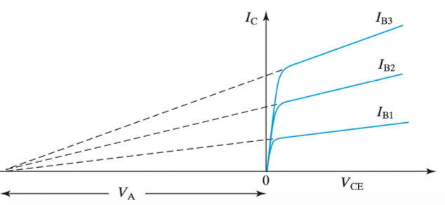
Output Resistance:$$r_0=(\frac{dI_C}{dV_{CE}})^{-1}=\frac{V_A}{I_C}$$
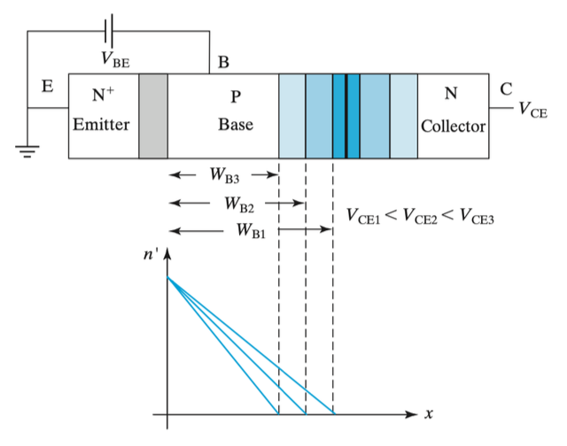
The base-width modulation effect is reduced if we:
1. Increase the base width
2. Increase the base doping concentration $N_B$
3. Decrease the collector doping concentration $N_C$

### Emitter efficiency
In a npn BJT, an emitter is efficient if the emitter current is mostly the useful electron current injected into the base with little useless hole current (the base current). The emitter efficiency is defined as $$\gamma_E=\frac{I_E-I_B}{I_E}=\frac{I_C}{I_C+I_B}$$
